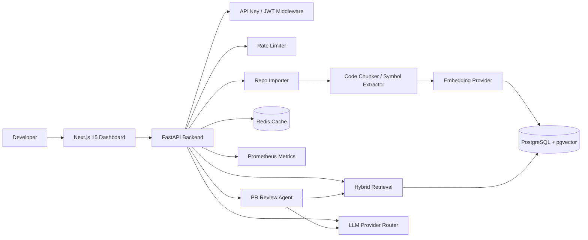

# Atlas — AI Codebase Intelligence & PR Review Agent

Atlas is a production-style AI developer tool — a navigational layer for complex codebases — that indexes a GitHub repository, builds code-aware retrieval over functions/classes/files, answers codebase questions with source citations, and reviews PR diffs for bugs, missing tests, risky changes, and design concerns.

It is designed as a FAANG-level portfolio project: clean architecture, hybrid retrieval, reranking-ready design, observability, tests, Docker, CI/CD, and measurable evaluation metrics.

## What it demonstrates

- **AI infrastructure:** embeddings, hybrid retrieval, grounded generation, provider abstraction, mock/offline mode.
- **Software engineering depth:** FastAPI service, Next.js frontend, PostgreSQL + pgvector, Redis, Docker Compose, CI.
- **Code intelligence:** line-aware chunking, symbol extraction, file citations, repo indexing.
- **Agentic workflow:** PR review pipeline that analyzes diffs, retrieves surrounding context, and produces structured findings.
- **Production readiness:** rate limiting, structured logging, Prometheus metrics, health checks, tests, typed APIs.

## Architecture



## Tech stack

### Frontend
- Next.js 15 App Router
- TypeScript
- Tailwind CSS
- shadcn-style reusable UI components
- Monaco-like code panels using lightweight pre/code blocks

### Backend
- FastAPI + Python 3.11+
- PostgreSQL 16 + pgvector
- Redis for cache/rate-limit extension point
- SQLAlchemy async + raw pgvector SQL
- Prometheus metrics
- Docker Compose

### AI/ML
- Local deterministic hash embeddings by default for free demos
- Optional OpenAI embeddings/LLM via env vars
- Hybrid retrieval: pgvector cosine similarity + PostgreSQL full-text search
- Source-grounded answers with file/line citations
- PR review agent workflow with structured findings

## Quick start

### 1. Clone and configure

```bash
cp .env.example .env
```

Default mode uses mock AI, so no API key is required.

### 2. Run with Docker

```bash
docker compose up --build
```

Services:
- Frontend: http://localhost:3000
- Backend: http://localhost:8000
- API docs: http://localhost:8000/docs
- Metrics: http://localhost:8000/metrics

### 3. Index the included sample repo

```bash
curl -X POST http://localhost:8000/api/repos/index-local \
  -H 'Content-Type: application/json' \
  -d '{"name":"sample-service","path":"/app/examples/sample_repo"}'
```

### 4. Ask a codebase question

```bash
curl -X POST http://localhost:8000/api/ask \
  -H 'Content-Type: application/json' \
  -d '{"repo":"sample-service","question":"Where is authentication handled?"}'
```

### 5. Review a PR diff

```bash
curl -X POST http://localhost:8000/api/pr-review \
  -H 'Content-Type: application/json' \
  -d @examples/sample_pr_review.json
```

## Optional real LLM mode

Set these in `.env`:

```bash
ATLAS_LLM_PROVIDER=openai
OPENAI_API_KEY=sk-...
ATLAS_OPENAI_MODEL=gpt-4o-mini
ATLAS_EMBEDDING_PROVIDER=openai
ATLAS_OPENAI_EMBEDDING_MODEL=text-embedding-3-small
ATLAS_EMBEDDING_DIM=1536
```

If you switch embedding dimensions after indexing, clear and reinitialize the database.

## Key APIs

| Endpoint | Method | Purpose |
|---|---:|---|
| `/health` | GET | Liveness/readiness info |
| `/metrics` | GET | Prometheus metrics |
| `/api/repos` | GET | List indexed repos |
| `/api/repos/index-local` | POST | Index a local repository path |
| `/api/repos/index-github` | POST | Clone and index a public GitHub repo |
| `/api/ask` | POST | Ask a repo-aware question |
| `/api/pr-review` | POST | Review a PR diff |
| `/api/evals/run` | POST | Run retrieval evaluation |

## Interview narrative

> I built Atlas, an AI developer tool that indexes large codebases and answers architecture/code questions with citations. The system uses AST-inspired code chunking, hybrid vector + lexical retrieval, pgvector HNSW indexes, grounded generation, and a PR review agent. I also built metrics for recall@k, latency, cost/query, cache hit-rate, and review finding quality.

## Resume bullets

```latex
\item Built \textbf{Atlas}, an AI codebase intelligence and PR review platform indexing \textbf{100K+ LOC} with AST-aware chunking, hybrid retrieval, reranking-ready search, and source-grounded answers.
\item Implemented an agentic PR review workflow using \textbf{FastAPI, pgvector, Redis, and LLM provider routing}, detecting bugs, missing tests, risky changes, and security issues across benchmark diffs.
\item Designed an evaluation harness measuring \textbf{recall@5, answer faithfulness, p95 latency, and cost/query}, enabling measurable retrieval quality and production-readiness discussions.
```

## Scalability discussion

- **Indexing:** move indexing to Celery/RQ workers for large repos; current synchronous path is sufficient for demos and small/medium repos.
- **Storage:** pgvector handles thousands to millions of chunks; for very large corpora, shard by repo/org or migrate retrieval to Milvus/Pinecone.
- **Retrieval:** hybrid query uses vector cosine + full-text rank; add cross-encoder reranking for top-50 candidates.
- **Latency:** cache embeddings and answers in Redis; stream LLM responses; precompute repo summaries.
- **Reliability:** blue/green index versions allow safe reindexing without downtime.
- **Security:** store repo tokens in secret manager; isolate per-tenant data by org_id; never send private code to external LLM unless explicitly enabled.

## Project structure

```text
atlas/
├── backend/              # FastAPI app
├── frontend/             # Next.js dashboard
├── examples/             # sample repo and PR diff
├── infra/                # database initialization
├── docs/                 # architecture and roadmap
├── .github/workflows/    # CI
├── docker-compose.yml
└── README.md
```
